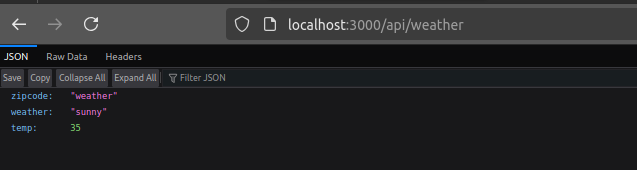
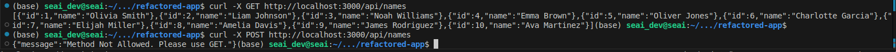

# Actividad 11: Refactorizacion de aplicacion Express.js y react a Next.js

- Migracion de rutas API
- Manejo de rutas dinamicas
- Creacion de interfaces personalizadas en TS
- Creacion de paginas con componentes personalizados de nextjs

> **OJO**
>
> Hago anotaciones en ingles para practicar algunas frases y tambien acostumbrarme a la jerga universal.

## Indice

- [Actividad 11: Refactorizacion de aplicacion Express.js y react a Next.js](#actividad-11-refactorizacion-de-aplicacion-expressjs-y-react-a-nextjs)
  - [Indice](#indice)
  - [Pasos para ejecutar el _app_](#pasos-para-ejecutar-el-app)
  - [Ejercicios](#ejercicios)
    - [Ejercicio 1: Agregar manejo de errores en las rutas API](#ejercicio-1-agregar-manejo-de-errores-en-las-rutas-api)
    - [Ejercicio 2: Integracion de CSS modular](#ejercicio-2-integracion-de-css-modular)
    - [Ejercicio 3: Extender la funcionalidad del contador en weahter.tsx](#ejercicio-3-extender-la-funcionalidad-del-contador-en-weahtertsx)

## Pasos para ejecutar el _app_

1. Vamos a llamar a nuestra aplicacion refactored-app

    Por lo que procedemos a instalar next.js

    ```shell
    npx create-next-app@latest refactored-app
    ## Una vez creado procedemos a ingresar a nuestra app :)
    cd refactored-app
    ```

    - Tener en cuenta que cuando se la primera linea lo he configurado de la siguiente manera

    ```shell
    Ok to proceed? (y) y

    ✔ Would you like to use TypeScript? … No / **Yes**
    ✔ Would you like to use ESLint? … No / **Yes**
    ✔ Would you like to use Tailwind CSS? … No / Yes
    ✔ Would you like your code inside a `src/` directory? … No / **Yes**
    ✔ Would you like to use App Router? (recommended) … No / **Yes**
    ✔ Would you like to use Turbopack for next dev? … **No** / Yes
    ✔ Would you like to customize the import alias (@/* by default)? … **No** / Yes
    ```

2. Instalar dependencias

    Algunas dependencias son necesarias para que nuestro entorno se ejecute con normalidad. 

    ```shell
    npm install --save-dev @types/react @types/node
    ```

3. Crear tipos personalizados

    Ya configurado nuestro entorno procedemos a realizar la actividad.

    En la raiz del proyecto profcedemos a crear el archivo `custom.d.ts` para almacenar las definiciones de interfaz y tipos personalizados especificamente para nuestra aplicacion Next.js

    - Para ello revisar el archivo creado: [custom.d.ts](refactored-app/custom.d.ts)

    > **Importante:**
    >
    > Usaremos la interfaz personalizada WeatherProps para el argumento props de la página que muestra los componentes meteorológicos, components/weather.
    >
    > El tipo WeatherDetailType es para la ruta de API api/weather/:zipcode, que utiliza un código postal obtenido dinámicamente.
    >
    >Finalmente, usamos responseItemType en la ruta de API api/names para tipar la respuesta de la obtención.

4. Creacion de rutas API en nextjs
   1. crear un nuevo *file*: `names.ts` en la carpeta `api`

   2. Editamos el contenido de este archivo: [names.ts](refactored-app/names.ts)

        ```ts
        // route api/names
        import type { NextApiRequest, NextApiResponse } from "next";

        type responseItemType = {
            id: string;
            name: string;

        }

        export default async function handler(
            req: NextApiRequest,
            res: NextApiResponse

        ): Promise<NextApiResponse<responseItemType[]> | void>{
            const url = 'https://www.usermodernfullstack.dev/api/v1/users';
            let data;
            try{
                const response = await fetch(url);
                data = (await response.json()) as responseItemType[];
            } catch (err){
                return res.status(500).json(err);
            }

            // tranformar los datos si es necesario
            const names = data.map((item: responseItemType) => ({
                id: item.id,
                name: item.name,
            }));
            return res.status(200).json(names);
        }
        ```

        > **Exportacion Estatica:**
        > - La aplicación exportada se ejecutará de forma independiente en todas las infraestructuras, ya que no necesita el servidor incorporado de Next.js
        > - Next nos permite pre-renderizar de diferentes maneras; para mas detalles en el siguiente enlace: [Understanding SSR, CSR, ISR, and SSG: A Comprehensive Guide](https://dev.to/dj1samsoe/understanding-ssr-csr-isr-and-ssg-a-comprehensive-guide-add)

5. Migrar la ruta dinamica `api/weather/:zipcode` del servidor Express a la aplicacion Nextjs
   1. Creamos un archivo [zipcode].js en la carpeta `api`. Aunque esto es lo que la guia nos dice... EL EsLint salta error por lo que cambiamos a extension `.ts`
   
   ```ts
    import type {NextApiRequest, NextApiResponse} from 'next';

    type WeatherDetailType = {
        zipcode: string;
        weather: string;
        temp?: number;
    }

    export default async function handler(
        req: NextApiRequest,
        res: NextApiResponse

    ): Promise<NextApiResponse<WeatherDetailType> | void> {
        return res.status(200).json({
            zipcode: req.query.zipcode,
            weather: 'sunny',
            temp: 35
        });
    }
    ```

6. Crear las rutas de las paginas
   1. Creamos pagina `hello.tsx` en la carpeta `pages`-> path: [hello.tsx](refactored-app/src/pages/hello.tsx)
        
        ```tsx
        // Renderuza el ejemplo Hello World y usa lso componentes personalizados Head, Link e Image de Nextjs

        import type { NextPage } from "next";
        import Head from "next/head";
        import Link from "next/link";
        import Image  from "next/image";

        const Hello: NextPage = () => {
            return (
                <div>
                    <Head>
                        <title>Titulo de pagina Hola Mundo</title>
                        <meta property="og:title" content="Hello World" key="title"/>
                    </Head>
                    <h1>Hello Safe Health!</h1>
                    <div> Usa el ancla de HTML para un
                        <a href="https://nostarch.com">enlace externo</a> 
                        y el cpmponente Link para una
                        <Link href="/components/weather">pagina interna </Link>
                        <Image src="/vercel.svg"
                            alt="Vercel Logo"
                            width={72}
                            height={16}
                        />
                    </div>
                </div>
            );
        };

        export default Hello;
        ```
   2. Crear pagina en la ruta `pages/components/weather.tsx`. El codigo adjunto [weather.tsx](refactored-app/src/pages/components/weather.tsx)

        ```ts
        import type { NextPage } from "next";
        import React,{useState,useEffect} from "react";

        const PageComponentWeather: NextPage = () => {
            interface WeatherProps {
                weather: string;
            }
            const WeatherComponent = (props: WeatherProps) => {
                const [count, setCount] = useState(0);
                useEffect(() => {
                    setCount(1);
                },[]);
                return (
                    <h1 onClick={() => setCount(count + 1)}>
                        El clima es {props.weather} y se ha actualizado {count} veces
                    </h1>
                );
            };
            return (
                <WeatherComponent weather="sunny" />
            );
        };

        export default PageComponentWeather;
        ```

        > **Importante:**
        >
        > El listado usa los hooks `useState` y `useEffect` para crear una interfaz de usuario reactiva.
        >
        > Podemos eliminar la definicion de interfaz personalizada para los WeatherProps de este file. `custom.d.ts` ya los añade

7. Ejecutamos la aplicacion
   1. Inicia la aplicacion con el siguiente comando

        ```shell
        npm run dev
        ```

    > **Nota:**
    > Fijate que estes en la ubicacion raiz de tu aplicacion para ejecutar el anterior comando.

8. Ejecutamos en el browser http://localhost:3000

9.  Provamos con las rutas
    - [x] http://localhost:3000/components/weather y nos debe salir el mensaje `El clima es sunny y se ha actualizado 8 veces` el numero se va actualizado cada vez que presionamos en el texto
    - [x] http://localhost:3000/hello y alli nos debe salir en pantalla la siguiente imagen 
    - [x] http://localhost:3000/api/weather el resultado debe ser de un JSON como se muestra en la imagen2 
    - [x] http://localhost:3000/api/names en este caso como no hemos cargado ningun ejemplo no nos sale nada en pantalla.

## Observaciones

- Al momento de probar las rutas API no me redirecciona a mi objetivo, en una version
me recomienda que la carpeta `api` debe estar dentro de `pages`. Y siii funciona genial!

No obstante en la ultima version de Next.js 13+ me sugiere la siguiente estructura en mi directorios:

```shell
src
├── app
│   ├── api
│   │   ├── names
│   │   │   └── route.ts
│   │   ├── weather/
│   │   │   └── [zipcode]/
│   │   │       └── route.ts

```

Sin embargo vamos a trabajar con la primera estructura en el que las rutas API las trabajamos en la carpeta `pages/api/`

## Ejercicios

### Ejercicio 1: Agregar manejo de errores en las rutas API

1. En la ruta `api/names.ts` modificar el codigo para manejar erres mas detallados. Y, no solo devolver un error 500, devuelva un mensaje de error especifico con el codigo de estado adecuado (400,404,etc).

    **Problemas identificados:**

     - **Manejo de errores generico(500)**: Ante cualquier error se devulve el error 500 (error interno del servidor)
       - **Problema técnico:** Esto no permite al cliente diferenciar si el problema fue un error en la solicitud, un fallo en la conexión externa o un problema interno.

     - **Respuesta insegura:**: El código devuelve directamente el objeto `err` al cliente.
       - **Problema técnico:** Esto puede exponer información sensible, como trazas del stack, que son útiles para el desarrollo, pero peligrosas en producción (exposicion de funciones, lineas de code, etc)
     - **Falta de validación de la respuesta externa:** No se verifica si la solicitud al servidor externo (fetch) es exitosa antes de procesar los datos.
  
     - **Falta de manejo para métodos HTTP específicos:** Actualmente, se permite cualquier método HTTP, pero solo el método GET debería ser aceptado.

    El codigo se veria asi:

    ``` ts
    // route api/names
    import type { NextApiRequest, NextApiResponse } from "next";

    type responseItemType = {
        id: string;
        name: string;

    }

    export default async function handler(
        req: NextApiRequest,
        res: NextApiResponse

    ): Promise<NextApiResponse<responseItemType[]> | void>{

        // validar el metodo HTTP permitido
        // nos permite proteger y limitar el alcance de una API.
        if (req.method !== "GET") {
            return res.status(405).json({
                // https://www.geeksforgeeks.org/how-to-fix-the-http-405-method-not-allowed-error/
                message: "Method Not Allowed. Please use GET.", 
            });
        }
        

        const url = 'https://www.usermodernfullstack.dev/api/v1/users';
        let data;

        try{
            const response = await fetch(url);
            
            // 2. Verificar el estado HTTP de la respuesta externa
            if (response.status === 204) { // tambien puede ser if(!response.ok){...}
                return res.status(response.status).json({
                    message: `Failed to fetch data from the externa API. Status: ${response.statusText}`,
                }) // el mensaje no tiene muchos detalles al cliente lo cual es lo ideal :D
            }

            // procesar la respuesta como JSON 
            data = (await response.json()) as responseItemType[];
            
        }catch (err) {
            console.error("Internal Server Error:", err);

            // manejar errores red o del fetch
            return res.status(500).json({
                message: "Internal Server Error. Please try again later.",
            })
        }
        
        // 4. Transformar los datos antes de enviarlos
        //      Procesamos y estructuramos los datos para que
        //      el cliente reciba solo lo necesario, sin datos adicionales o irrelevantes.
        const names = data.map((item: responseItemType) => ({
            id: item.id,
            name: item.name,
        }));

        // responder con los datos procesados
        return res.status(200).json(names);
    }
    ```

    Revisar si es que en realidad funciona ejecuto los siguientes comandos en mi consola

    ```shell
    ## Permite
    curl -X GET http://localhost:3000/api/names

    ## No permite
    curl -X POST http://localhost:3000/api/names

    ```

    - Lo cual probamos yy efectivamente nso resulta
        

2. Hacer lo mismo en la ruta `api/weather/[zipcode].ts`, incluyendo un caso en el que el code postal no es valido(e.g. si es un codigo que no cumple con los requisitos de longitud)

    **Problemas identificados:**
    - Falta validacion del parametro zipcode: longitud o tipo
    - Si no se proporciona un zipcode válido, el código no devuelve un estado HTTP descriptivo (por ejemplo, `400 Bad Request`).
    - No se verifica si el parámetro dinamico (zipcode) existe antes de intentar usarlo.
    - Solo sol. GET
    
    El code quedaria asi:
    ```ts
    import type {NextApiRequest, NextApiResponse} from 'next';

    type WeatherDetailType = {
        zipcode: string;
        weather: string;
        temp?: number;
    }

    export default async function handler(
        req: NextApiRequest,
        res: NextApiResponse

    ): Promise<NextApiResponse<WeatherDetailType> | void> {

        // permite solo solicitudes get
        if (req.method !== "GET") {
            return res.status(405).json({
                // https://www.geeksforgeeks.org/how-to-fix-the-http-405-method-not-allowed-error/
                message: "Method Not Allowed. Please use GET.", 
            });
        }

        const {zipcode} = req.query;

        // Verificar si el parámetro existe y que sea un string
        if (!zipcode || typeof zipcode !== "string" ) {
            return res.status(400).json({
                message: 'Invalid or missing zipcode. Please provide a valid zipcode'
            })
        }
        // Longitud del zipcode de 5 
        if (zipcode.length !== 5) {
            return res.status(400).json({
                message: 'Invalid zipcode length. Zipcode must be exactly 5 characters.'
            });
        }

        // si el codigo postal cumple con las condiciones, mostramos los datos simulados
        return res.status(200).json({
            zipcode: req.query.zipcode,
            weather: 'sunny',
            temp: 35
        });
    }
    ```

3. **Pregunta teorica:**
    Por qué es importante devolver codigos de estado HTTP adecuados en las API y cómo pueden afectar la experiencia del usuario o el comportanmiento de los clientes que consumen la API?

    1. **Contexto de los Códigos de Estado HTTP**

        Los códigos HTTP están divididos en varias categorías:

       - **2xx (Éxito):** Indica que la solicitud fue procesada con éxito.
       - **3xx (Redirección):** Sugiere que el cliente debe realizar una acción adicional para completar la solicitud.
       - **4xx (Errores del Cliente):** Indican problemas con la solicitud realizada por el cliente.
       - **5xx (Errores del Servidor):** Señalan fallos del servidor al procesar la solicitud.

    2. **Razones para Devolver Códigos Adecuados**

        - Comunicación Clara entre Cliente y Servidor
        - Mejora la Experiencia del Usuario
        - **Optimización de Recursos:** Un manejo incorrecto podría generar sobrecarga en el servidor debido a solicitudes repetidas o mal diseñadas.
        - Depuracion de codigo

### Ejercicio 2: Integracion de CSS modular

1. reafacctorizar las paginas `hello.tsx` y `components/weather.tsx` para que se utilicen archivos de estilos CSS modulares. Crea archivos como `Hello.module.css` y `weather.module.css`.
2. Asegurese de que cada componente tenga su propio archivo de estilos para manter los estilos aislados.
    El codigo modificado me genera los siguientes resultados

    - Para Hello.module.css

        

    - Para Weather.module.css

        
3. **Pregunta teorica:**
    Explica la ventaja de usar CSS modular en comparacion con el uso de un archivo CSS global en una aplicacion grande

| Aspecto       |	CSS Modular | CSS Global |
|   ---------   | ------------| -----------|
|Aislamiento    | Estilos exclusivos para cada componente |	Estilos compartidos, posibles conflictos |
|Escalabilidad  |	Fácil de escalar en aplicaciones grandes |	Difícil de manejar con muchos estilos |
|Mantenimiento  |	Localización rápida y específica de estilos	 | Difícil de depurar en archivos grandes |
|Sobreescritura | Evita conflictos al generar nombres únicos	| Propenso a conflictos entre clases |
| Rendimiento   |	Solo se carga lo necesario para cada componente	| Carga estilos innecesarios |
|Colaboración   |	Facilita el trabajo simultáneo de múltiples desarrolladores	| Puede causar bloqueos entre equipos |

### Ejercicio 3: Extender la funcionalidad del contador en weahter.tsx

1. Modificar el contador del componente WeatherComponent para que se guarde en ``localStorage``. De esta manera, cuando el usuario recargue la pagina, el contado mantendra su valor
2. Utiliza `useEffect` para verificar si el valor del contador ta esta almacenado  en `localStorage` al cargar la pagina.

    Los cambios realizados dentro del code son los siguientes:
    - Inicialización del Estado desde localStorage

        ```ts
        useEffect(() => {
            const storedCount = localStorage.getItem("weather-counter");
            if (storedCount) {
                setCount(Number(storedCount));
            }
        }, []);
        ```

    - Guardar el Estado en localStorage
        
        ```ts
        useEffect(() => {
            localStorage.setItem("weather-counter", count.toString());
        }, [count]);

        ```
3. **Pregunta teorica:**
    Como puede usar localStorage en una aplicacion Next.js para guardar datos de sesion, y cuales son las limitaciones de esta aproximacion.

        El uso de localStorage en Next.js es útil para almacenar datos no sensibles de sesión, como configuraciones de usuario o estados temporales, *Offline access* de modo que el almacenamiento en memoria cache se puede acceder con o limitado internet.
        
        More storage capacity, por ejemplo las _cookies_ estan limitadas a 4kilobites por dominio. Mientras que `localStorage` puede almacenar hasta 5 megabytes por domnio. Sin embargo, tiene limitaciones significativas, como falta de seguridad y sincronización.

        Ejemplo: preferencias del usuario (tema oscuro/claro) o valores temporales como un contador o un carrito de compras.
    Fuentes consultadas: 
        
    - [How to Use LocalStorage in JavaScript](https://www.freecodecamp.org/news/use-local-storage-in-modern-applications/#limitations-of-using-local-storage)
    - [LocalStorage, sessionStorage](https://javascript.info/localstorage)