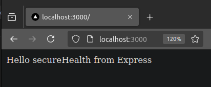

# Actividad 12: Creacion y exploracion de apliaciones web con express

## Obejetivo

Laboratorio para crear aplicaciones web usando el _framework_ de Express

- Instalar  y configurar una aplicación Express básica
- Utilizar plantillas para renderizar contenido dinámico
- Crear rutas estáticas y dinámicas
- Manejar solicitudes y respuestas HTTP
- Integrar middleware
- Utilizar herramientas de depuración.

## Dependencias necesarias

- Express==4.x
- Nodejs==20.11.0

Instalar Express

```shell
npm install express@4
```

## AHORA COMENCEMOS

- Crear un archivo helloWorld.js

```js
import express from 'express';

const app = express();
const port = 3000;

// Definimos una ruta para la ruta  raíz '/'
// y enviamos una respuesta con el texto ¡Hello worlds desde Express!
app.get('/',(req,res) => {
    res.send('Hello secureHealth from Express');
})

app.listen(port,()=>{
    console.log(`App Hello secureHealth listens from ${port} port.`)
})

```

y probamos ejecutando el siguente comando

```shell
node helloWorld.mjs
```

La extension es solo para trabajar con modulos :D

- El reasultado obtenido es el siguiente adjunto en la imagen.

    

### Usando el generador

Usamos la linea de comando para generar una palicacion basica. Dado que crea muchos archivos creamos una carpeta `generatorUse

```shell
mkdir generadorUse
## generador
npx express-generator@4
```

- Instalamos las dependencias

```shell
npm install
```

- iniciamos la aplicacion - run the app

```shell
npm start

## tambien le podemos indicar que solo me imprima determinados espacios de nombres
```

### Volvemos a nuestro ejemplo inicial

Ahora tenemos nocion de como se ejecuta por lo que continuamos con nuestro ejemplo

creamos tanto `helloWorldTemplate.js` y `index.ejs`

```shell
touch helloWorldTemplete.js views/index.ejs
```

editamos los codigos

`views/index.ejs`

```html
<!DOCTYPE html>
<html lang="en">
    <head>
        <meta charset="UTF-8">
        <title> <%= title%></title>

    </head>
    <body>
        <h1><%=title%></h1>
        <h2><%= subtitle %></h2>
    </body>
</html>
```

`helloWorldTemplate.js`

```js
import express from 'express';

const app = express();
const port = 3000;

// Configurar el motor de plantillas
app.set('view engine', 'ejs');

// Ruta principal
app.get('/', (req, res) => {
    res.render('index', {
        title: 'Este es un app de Express',
        subtitle: 'usando EJS como plantilla',
    });
});

// Iniciar el servidor
app.listen(port, () => {
    console.log(`App corriendo en http://localhost:${port}`);
});

```

ahora intelamos dependencias y ejecuatamos

```shell
npm install ejs@3
## running
node helloWorldTemplate.js
```

deberiamos de ber los isguiente: 

## Expresiones permitidas

Tenemos opciones para tipar nuestras rutas de modo que puedes ser:

- parametros dinamicos
- rutas estaticas
- parametros opcionales
- con expresiones regulares
- parametros de consulta
- Hay un orden de ejecucion. por lo que el orden de definir la ruta si importa
- manejadores o middleware

  - parametros del _manejador__
    - [request](https://expressjs.com/en/4x/api.html#req): toda la información sobre la solicitud, incluidos los parámetros, IP, encabezados, cuerpo, y así sucesivamente.
    - response: contiene todos los métodos para manejar la respuesta de la solicitud
    - next: delegar la solicitud al siguiente manejador.

### Dominando respuestas

- gestion de encabezados: envia informacion adicional sobre la respuesta. Usa metodo `set`.

    ```js
    app.get('/', (req, res, next) => {
        res.set('Content-Type', 'text/html')
        res.send("<h1>Hello World</h1>")})
    ```

En el ejemplo anterior, estamos configurando el encabezado Content-Type a text/html para que el navegador sepa que la respuesta es un documento HTML y lo renderice como HTML.

- Multiples encabezados:

    ```js
    app.get('/', (req, res, next) => {
        res.set({'Content-Type': 'text/html','x-powered-by': 'Unicornio y arco iris'})
        res.send("<h1>Hello World</h1>")}
        )
    ```

En el código anterior, estamos configurando dos encabezados, Content-Type y x-powered-by

- Eliminado encabezados

    ```js
    app.get('/', (req, res, next) => {
        res.set({'Content-Type': 'text/html','x-powered-by': 'Unicornios y arco iris'})
        res.removeHeader('x-powered-by')res.send("<h1>Hello World</h1>")
        })
    ```

## Ejercicios Teóricos

### 1. Conceptos básicos de Express
**Pregunta:** ¿Qué es Express en el contexto de Node.js y cuáles son sus principales ventajas al desarrollar aplicaciones web?

**Respuesta:**
Express es un framework web minimalista y flexible para Node.js que permite construir aplicaciones web y APIs con facilidad. Se utiliza para manejar rutas, solicitudes y respuestas HTTP, middleware, y otras funcionalidades esenciales en el desarrollo web.

**Ventajas principales:**
- **Minimalista y flexible:** Express no impone una estructura rígida, lo que brinda libertad para adaptar la aplicación según las necesidades.
- **Extensibilidad:** Permite agregar middleware y bibliotecas de terceros fácilmente.
- **Fácil de aprender:** La API es sencilla, ideal tanto para principiantes como para desarrolladores avanzados.
- **Activa comunidad y ecosistema:** Hay una amplia cantidad de recursos, tutoriales y bibliotecas que complementan Express.
- **Integración con motores de plantillas y frontend frameworks:** Soporta motores como EJS y frameworks como React.

---

### 2. Generación de aplicaciones con express-generator
**Pregunta:** Explica qué es express-generator y cuáles son los beneficios de utilizar esta herramienta al iniciar un nuevo proyecto con Express.

**Respuesta:**
`express-generator` es una herramienta de línea de comandos que genera automáticamente la estructura básica de un proyecto Express, incluyendo carpetas y archivos preconfigurados como rutas, vistas, y configuraciones.

**Beneficios:**
- **Ahorro de tiempo:** Crea una estructura inicial lista para trabajar, eliminando la necesidad de configuraciones manuales.
- **Consistencia:** Proporciona una estructura estándar que facilita la colaboración entre equipos.
- **Preconfiguración:** Incluye configuraciones básicas como el manejo de rutas, vistas, y archivos estáticos.
- **Fácil exploración:** Ideal para principiantes que desean comprender cómo funciona una aplicación Express bien estructurada.

---

### 3. Motores de plantillas en Express
**Pregunta:** ¿Qué es un motor de plantillas en Express y por qué es importante? Menciona al menos dos motores de plantillas populares compatibles con Express.

**Respuesta:**
Un motor de plantillas en Express es una herramienta que permite renderizar contenido dinámico en el servidor, generando páginas HTML a partir de plantillas que interpolan datos enviados por el backend.

**Importancia:**
- **Generación de contenido dinámico:** Permite insertar datos (como usuarios, listas, etc.) en las vistas antes de enviarlas al cliente.
- **Separación de responsabilidades:** Ayuda a mantener el código HTML separado de la lógica del servidor.
- **Facilita la personalización:** Útil para aplicaciones que necesitan diferentes vistas dependiendo del contexto.

**Motores de plantillas populares:**
1. **EJS (Embedded JavaScript):** Sencillo y fácil de usar, utiliza sintaxis similar a JavaScript.
2. **Pug:** Motor de plantillas con sintaxis minimalista, anteriormente conocido como Jade.

---

## 4. Manejo de solicitudes y respuestas HTTP
**Pregunta:** Describe los componentes clave del manejo de solicitudes y respuestas HTTP en Express, incluyendo los objetos `req`, `res` y la función `next`.

**Respuesta:**
1. **`req` (Request):**
   - Representa la solicitud HTTP entrante.
   - Contiene información sobre la solicitud como:
     - Rutas y parámetros (`req.params`).
     - Cuerpo de la solicitud (`req.body`).
     - Encabezados (`req.headers`).
     - Consultas (`req.query`).

2. **`res` (Response):**
   - Representa la respuesta que el servidor enviará al cliente.
   - Métodos comunes:
     - `res.send()`: Enviar una respuesta de texto o HTML.
     - `res.json()`: Enviar datos en formato JSON.
     - `res.status()`: Establecer el código de estado HTTP.

3. **`next` (Next):**
   - Es una función que pasa el control al siguiente middleware o manejador en la pila.
   - Útil para:
     - Procesar lógica compleja en pasos.
     - Manejo de errores.

---

### 5. Importancia del orden en las rutas
**Pregunta:** ¿Por qué es crucial el orden en que se definen las rutas en una aplicación Express? Proporciona un ejemplo de cómo el orden puede afectar el comportamiento de la aplicación.

**Respuesta:**
El orden de las rutas es crucial porque Express evalúa las rutas en el mismo orden en que se definen. Si una ruta general está definida antes que una específica, esta última podría no ejecutarse, ya que la primera coincide y maneja la solicitud.

**Ejemplo:**

```javascript
const express = require('express');
const app = express();

app.get('/users/:id', (req, res) => {
  res.send(`Usuario con ID: ${req.params.id}`);
});

app.get('/users/me', (req, res) => {
  res.send('Perfil del usuario actual');
});

// Puerto
app.listen(3000, () => console.log('Servidor corriendo en http://localhost:3000'));

```

Problema: Si accedes a http://localhost:3000/users/me, el servidor responderá con:

```vbnet
Usuario con ID: me
```

Porque /users/:id se evalúa primero y coincide con cualquier valor.

Solución: Coloca las rutas específicas antes que las generales:

```js
app.get('/users/me', (req, res) => {
  res.send('Perfil del usuario actual');
});

app.get('/users/:id', (req, res) => {
  res.send(`Usuario con ID: ${req.params.id}`);
});

```

Ahora http://localhost:3000/users/me responderá correctamente con

```shell
Perfil del usuario actual

```
